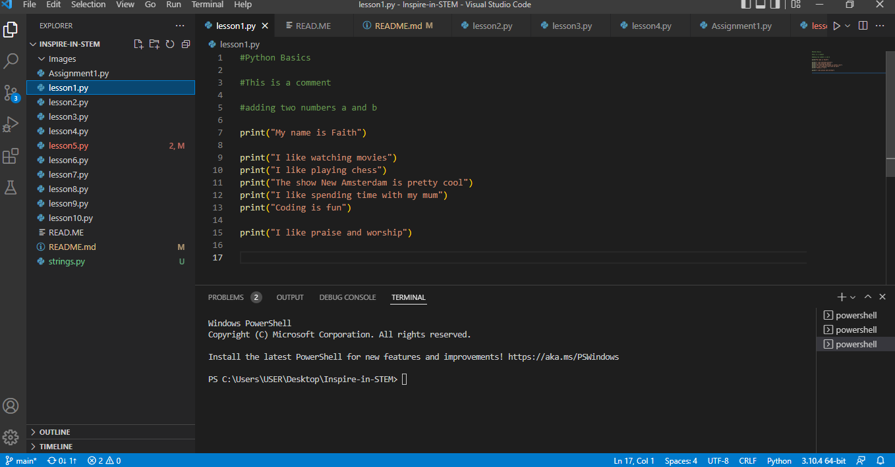
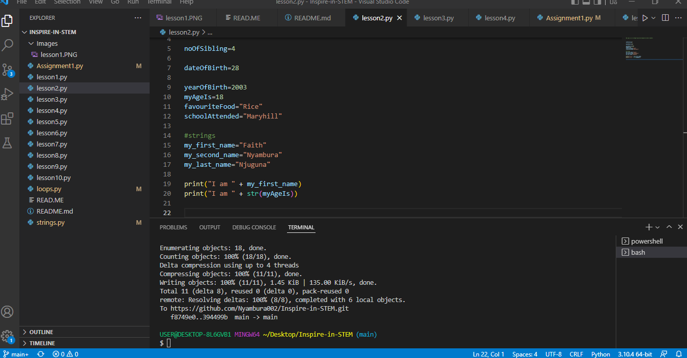
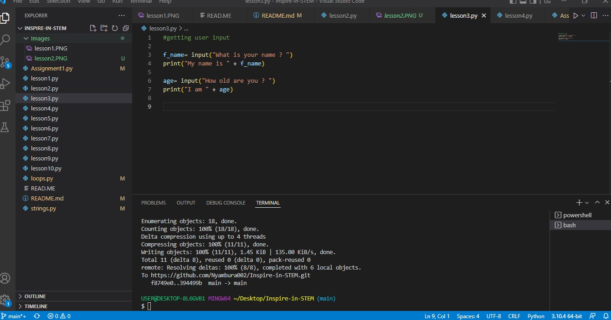
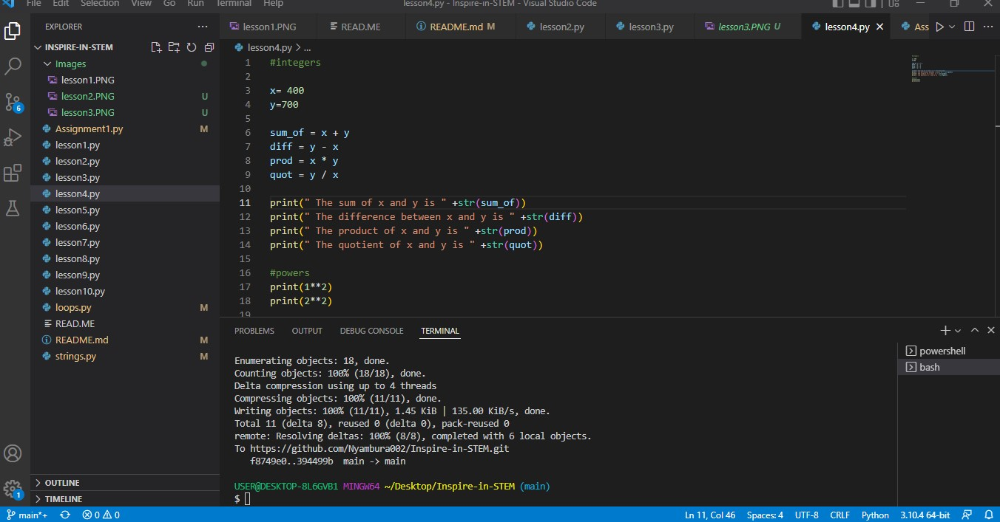
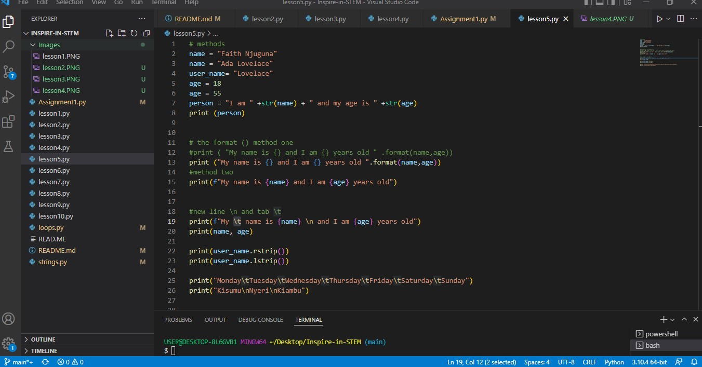
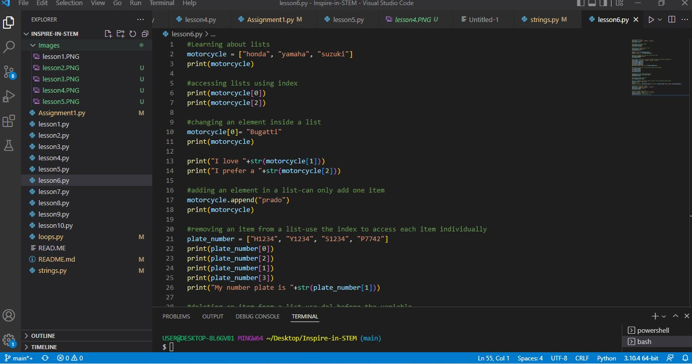
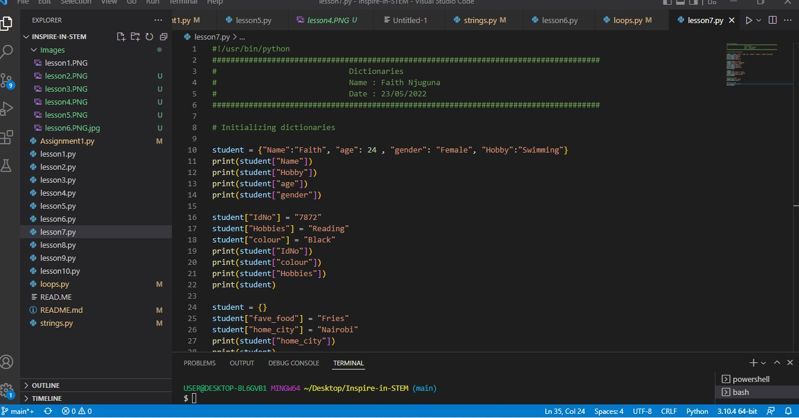
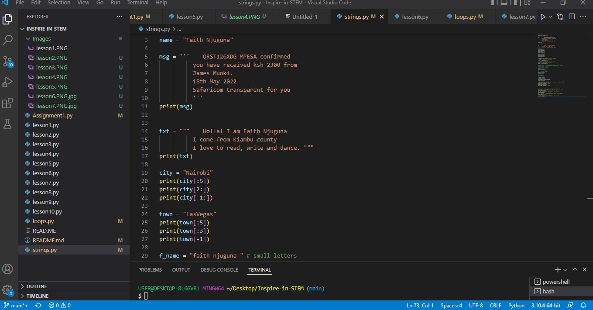
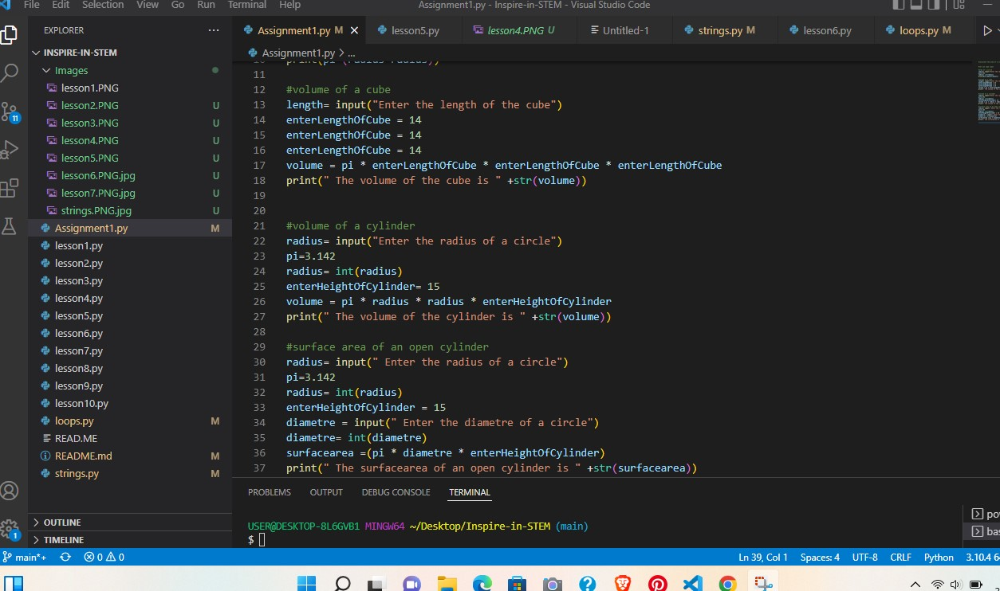

#!/usr/bin/python
### Inspire Youth in STEM

## Week 1: Introduction to Python
Day 1 : installing python

Add a link to download python
https://www.python.org/downloads/

Add link to downloading vs code
https://code.visualstudio.com/download

Add link to downloading git for windows
https://gitforwindows.org/

Strings
    replace()
    strip()
    slice()
    format()
    upper()
    lower()
    len()

## Week 2: Electronics for Innovators

## Week 3: Introduction to Robotics

## Week 4: Javascript, css, html

## Week 5: Design Thinking, UX, UI

## Week 6: Pitch competition, campus tour.